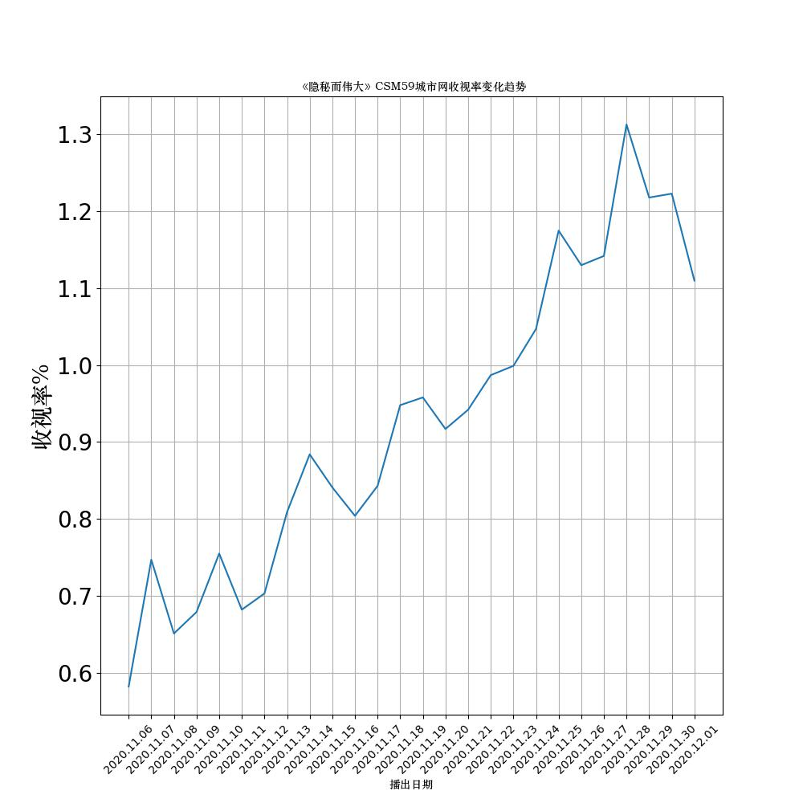
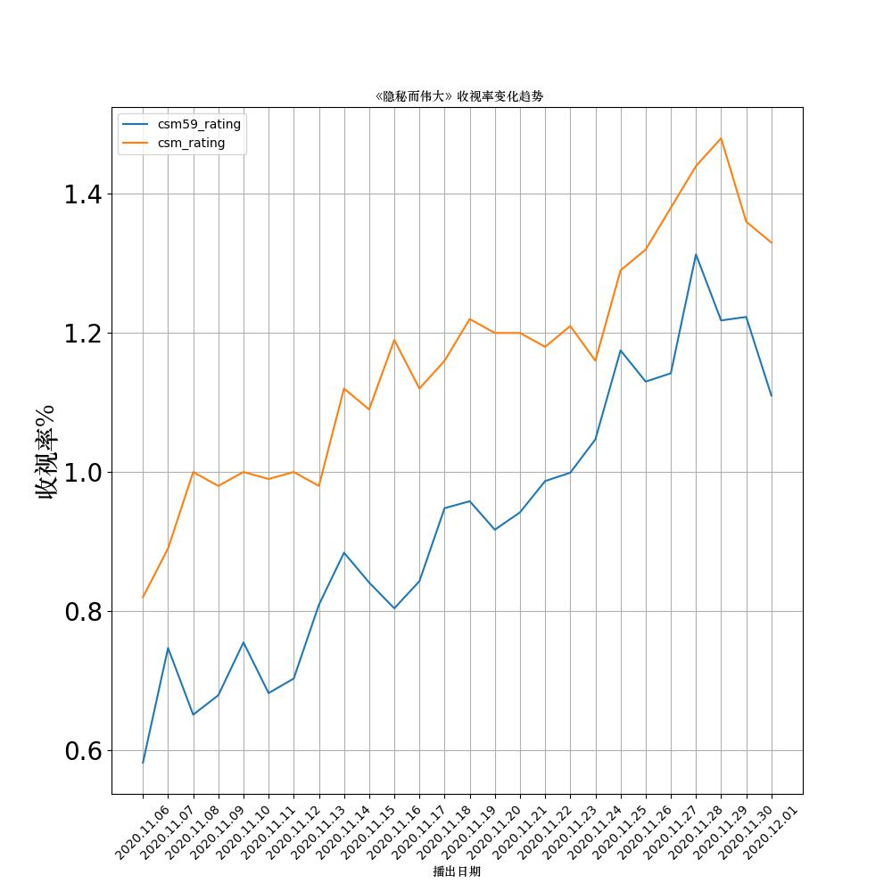

# 机器学习爬取网页数据

## 编译遇到的问题

## 1.如何利用external_libraries的库文件完成编译

因为paddle环境里的包存在文件缺失问题，不建议这么做，不依赖external_libraries编译需要安装以下包

### 本地编译：
在自己的conda环境里安装以下包：
*   pip install jieba
*   pip install wordcloud
*   pip install bs4
*   pip install lxml

### paddle编译：
进入paddle环境后，打开Notebook旁边的终端窗口，依次输入以下命令，安装缺失的包：
*   pip install jieba
*   pip install wordcloud
*   pip install bs4
*   pip install lxml

## 2.运行代码时偶尔find_all()函数报错
办法：这个问题在于翻墙，如果以下网站能够访问，就不会报错。[点击这里《隐秘而伟大》](https://baike.baidu.com/item/%E9%9A%90%E7%A7%98%E8%80%8C%E4%BC%9F%E5%A4%A7/22454129?fr=aladdin) 报错请先自行解决网络问题。

## 3.字体问题
### 字体文件如何下载
1.你可以使用本项目的字体文件[字体STZHONGS.TTF](https://github.com/liuqi34584/crawl/blob/main/work/STZHONGS.TTF)

2.也可以利用windows自带的字体，在你的电脑文件路径 C:\Windows\Fonts 中，复制一款你想要的字体到项目中即可。
### 词云图片字体问题

首先，我们已经找到了上面的字体文件。然后添加以下代码给词云配置字体路径，即font_path

```python
wc = wordcloud.WordCloud(
    font_path= './work/STZHONGS.TTF',  # 设置字体格式
    background_color="#ffffff",  # 设置背景图
    max_words=150,  # 最多显示词数
    max_font_size=120,  # 字体最大值
    width=707,
    height=499
)
```
### paddle环境中plt字体问题

paddle中的matplotlib字体不能显示中文，paddle不太方便直接修改包路径，所以这里利用修改matplotlib字体配置路径修改字体，将下面代码添加到项目中即可，代码如下
```python
# 引入自定义字体包
import matplotlib.font_manager as fm  

# 设置字体---myfont
myfont = fm.FontProperties(fname=r'./work/STZHONGS.TTF') 

# plot时设置字体属性---myfont
plt.figure(figsize=(10, 6))
plt.xlabel("播出日期",fontsize=10,fontproperties=myfont) 
plt.ylabel("收视率%",fontsize=20,fontproperties=myfont) 
plt.show()
```

## 3.本项目代码移植到paddle
### 1 环境问题参考第一点
### 2 文件
请将本项目work目录中，这两个文件上传到paddle环境work目录下
* crawl_wiki_data.py 
* STZHONGS.TTF

然后，将本项目work目录中generate_wc.py中的代码复制到paddle环境notebook中
 ### 3 适应编译
 解决本地环境与paddle环境的差异，在paddle的Notebook中，将
 ```python
from crawl_wiki_data import crawl_wiki_data
from crawl_wiki_data import crawl_everyone_wiki_urls
from crawl_wiki_data import crawl_viewing_data
from crawl_wiki_data import parse_viewing_data
 ```
修改为
 ```python
from work.crawl_wiki_data import crawl_wiki_data
from work.crawl_wiki_data import crawl_everyone_wiki_urls
from work.crawl_wiki_data import crawl_viewing_data
from work.crawl_wiki_data import parse_viewing_data
 ```


## 编译结果

爬虫结果词云展示如图


爬虫结果趋势图：





<br/>

## 一、实验目的
1. 在当今信息化时代，互联网上充斥着各种各样的数据，这些数据对于机器学习的研究和应用具有重要的价值。然而，要从海量的网页中提取出有用的信息并不容易，需要借助一种称为网络爬虫的技术。网络爬虫是一种自动获取网页内容并存储到本地或数据库中的程序，它可以根据指定的规则和策略来访问目标网站，并解析出所需的数据。
2. 本实验旨在通过开发网络爬虫来获取百度百科中《隐秘而伟大》页面上关于演员的信息，以及收视率的数据，并将其可视化表格和词云展示。这样可以方便地观察《隐秘而伟大》的演员热度和收视率，并为进一步的机器学习分析提供基础。
3. 本实验主要包括以下几个步骤：第一步：选择百度百科中《隐秘而伟大》页面作为爬取对象，并确定将演员信息，收视率作为爬取内容等。第二步：编写网络爬虫程序，使用Python语言和相关库（如requests、BeautifulSoup等），发送HTTP请求到目标网站，并从返回的HTML文档中解析出所需的数据，并进行格式化处理。第四步：开发程序可视化数据，使用Python语言和相关库（如matplotlib，BeautifulSoup，wordclound等），设计出清晰直观的数据折线图，选择时间刻度绘制相应的折线图斌且生成词云图片。
## 二、原理分析
本实验的原理主要涉及到两个方面：网络爬虫和数据可视化。
网络爬虫是一种自动获取网页内容并存储到本地或数据库中的程序，它可以根据指定的规则和策略来访问目标网站，并解析出所需的数据。网络爬虫的工作流程一般包括以下几个步骤：
1. 获取初始的URL，即要爬取的网站的入口地址。
2. 发送HTTP请求到目标网站，并获取返回的HTML文档。
3. 从HTML文档中解析出新的URL和所需的数据，并进行格式化处理。
4. 将新的URL加入到待爬取队列中，并将数据存储到本地或数据库中。
5. 重复第2-4步，直到满足停止条件或者没有新的URL可爬取为止。


网络爬虫在实现过程中需要考虑一些问题，如如何避免重复爬取相同或无关的网页、如何应对反爬虫机制、如何提高爬取效率和质量等。不同类型和目标的网络爬虫可能采用不同的方法来解决这些问题，例如使用哈希表或布隆过滤器来去重、使用代理IP或更换User-Agent来伪装身份、使用多线程或异步IO来提高并发性等。

数据可视化是一种将数据转换为图形或图像形式以便于观察和分析的技术，它可以帮助人们发现数据中隐藏的规律和趋势，并提供更直观和有效的信息传递方式。数据可视化涉及到以下几个方面：

1. 数据选择，即确定要展示哪些数据以及展示方式（如折线图、柱状图、词云等）。
2. 数据处理，即对原始数据进行清洗、转换、聚合等操作，使其符合可视化要求。
3. 数据映射，即将处理后的数据映射到图形元素上，并设置颜色、大小、位置等属性。
4. 数据呈现，即将生成的图形元素绘制在画布上，并添加标题、图例、坐标轴等辅助信息。
5. 数据交互，即为用户提供与图形元素进行交互（如放大缩小、筛选条件等）以获取更多细节信息或改变视角等功能。


数据可视化在实现过程中需要考虑一些问题，如如何选择合适的展示方式和颜色搭配以突出重点和美观性、如何保证图形元素之间不重叠或遮挡以提高清晰度和易读性、如何设计友好且功能完善的用户界面以提高用户体验等。


本实验中使用词云图来展示数据中的高频关键词。词云图是一种将文本中的关键词转换为图形或图像形式以便于观察和分析的数据可视化技术，它具有以下几个优点：
1. 词云图可以突出显示文本中出现频率较高的关键词，从而帮助人们快速发现文本的主题和重点。
2. 词云图可以通过改变关键词的字体大小、颜色、位置等属性来增强视觉效果和美观性，从而吸引人们的注意力和兴趣。
3. 词云图可以根据不同的需求和场景选择不同的形状、背景、风格等元素来定制个性化的展示方式，从而提高信息传递的效率和质量。
4. 词云图可以为用户提供与关键词进行交互（如放大缩小、筛选条件等）以获取更多细节信息或改变视角等功能，从而提高用户体验和参与度。

## 三、数据处理步骤

本实验的处理过程主要包括以下几个方面：

1. 爬取目标的定义和描述：在开始爬取网页数据之前，需要明确我们想要获取什么样的数据，以及这些数据有什么特点和用途。例如，我们可以百度百科中《隐秘而伟大》页面上关于演员的信息，以及收视率的数据。依次获得对这部电视剧收视率的分析。

2. 初始URL的获取：为了启动爬虫程序，我们需要提供一个或多个初始的URL，作为爬虫的入口点。这些URL可以通过手动输入、搜索引擎、网站地图等方式获得。本次实验中手动输入URL,将URL地址放在Python代码中。

3. 网页请求和解析：在获得初始URL后，我们需要使用requests库或其他库来向目标网站发送HTTP请求，并获取响应中包含的网页内容。然后，我们需要使用BeautifulSoup库或其他库来解析网页内容，并提取出我们感兴趣的数据和新的URL。本次实验中我们主要将演员信息，收视率作为爬取内容等信息，并保存到本地文件中。

4. 数据分析和挖掘：在完成网页数据爬取后，我们就可以对收集到的数据进行分析和挖掘操作了。如使用文本分类算法来对话题进行标签化；或者使用聚类算法来发现不同话题之间的相似性；或者使用回归算法来预测某个问题会获得多少赞同数等。本次实验中，我们主要从数据中提取出演员信息，收视率，如民族，星座，血型，身高，体重，出生日期，收视情况等，

